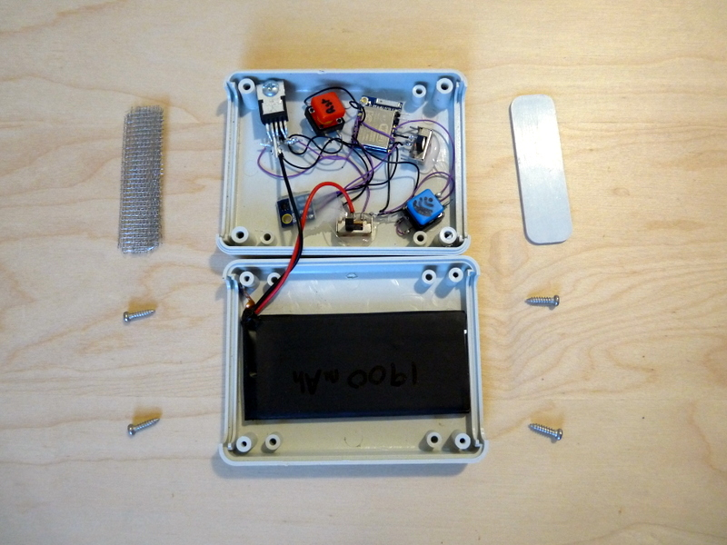

# EspDataLogger
Low power data logger using ESP8266.

This is a portable/autonomous data logger that monitors temperature and relative humidity.

## Precision

  - Temperature: ±0.4 °C (max), –10 to 85 °C
  - Relative Humidity: ± 3% RH (max), 0–80% RH

## Power consumption

| Parts \ Power | Running (µA)  | Deep sleep (µA)  |
| ------------- |:-------------:| ----------------:|
| ESP8266       |      900      |        10        |
| SI7021        |      120      |        0.06      |
| LT1529        |      50       |        50        |
| **TOTAL**     |    **1070**   |      **60.06**   |

Computation of power consumption for a sampling rate of 15 minutes (We estimate that the running time is approximately one seconds):
    
    1070 * 10^-3 * 1/3600 + 60.06 * 10^-3 * 15/60 ≈ 0.015mAh

Considering a battery of 1900mAh this device **could ideally store 126666 points** of data. The main restriction will be the size of the flash memory.

## Data storage

The [FS library](http://esp8266.github.io/Arduino/versions/2.0.0/doc/filesystem.html) is used to store the data in the ESP8266 internal flash memory.

If we consider the smallest flash memory available, which is 64 kilobytes, we can compute the maximum number of data points that can be stored.
Each point is composed of 2 ints: temperature tipically 4 digits, and humidity tipically 2 digits plus a coma separator, 1 byte.

    64000 / (4 + 2 + 1) = 9142 points of data

Considering a sampling rate of 15 minutes it **could ideally run for more than 95 days** .

## Size and weight

  * Weight: 88g
  * Size: 90x70x28mm

## Pictures

## Hardware design

Parts list:

  - ESP8266 Esp07 microcontroler
  - SI7021 temperature and humidity sensor
  - LT1529-3.3 voltage regulator
  - 22uF 100V elec. capacitor
  - 1900mAh 3.7V LiPo battery

Remember to remove any LED that would unnecessarily draw current.

## Software design

Change the constants according to your needs:

  - WAKEUP_RATE: how long should the device be sleeping between each data point.
  - DEBUG: turn to 1 to get log messages via serial monitor.
  - RETRIEVE: turn to 1 to read the list of data points, stored in the flash memory, via serial monitor.
  - DELETE: turn to 1 to erase the data points from the flash memory.