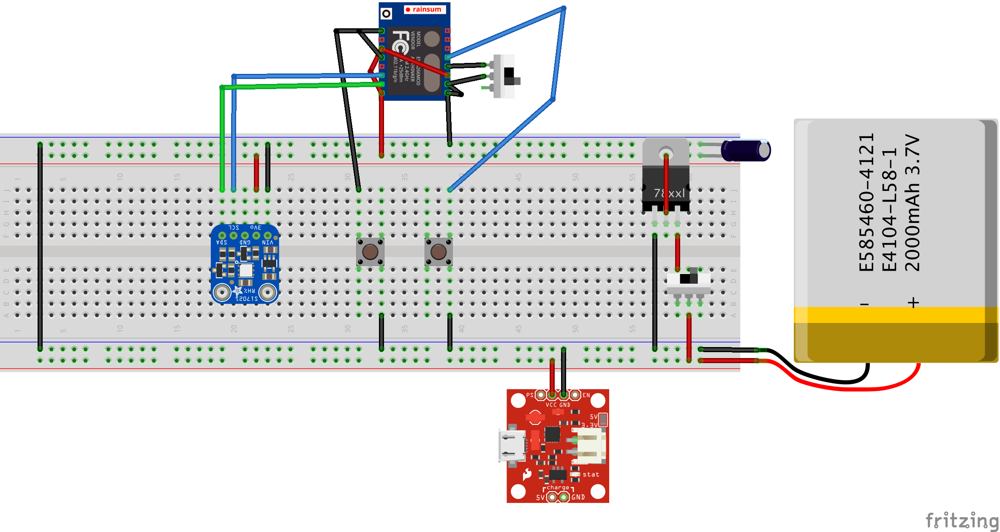

# EspDataLogger
Low power consumption data logger using ESP8266

## Parts list

  - ESP8266 Esp07 microcontroler
  - SI7021 temperature and humidity sensor
  - LT1521CST-3.3 voltage regulator
  - 22uF 100V elec. capacitor
  - 1900mAh 3.7V LiPo battery

## Power consumption

| Parts \ Power | Running (µA)  | Deep sleep (µA)  |
| ------------- |:-------------:| ----------------:|
| ESP8266       |      900      |        10        |
| SI7021        |      120      |        0.06      |
| LT1521CST     |      12       |        12        |
| **TOTAL**     |    **1032**   |      **22.06**   |

Computation of power consumption for a sampling rate of 15 minutes (We estimate that the running time is approximately one seconds):
    
    1032 * 10^-3 * 1/3600 + 22.06 * 10^-3 * 15/60 ≈ 0.0058mAh

Considering a battery of 1900mAh this device could ideally store 327492 points of data. The main restriction will be the size of the flash memory.

## Storage

The [FS library](http://esp8266.github.io/Arduino/versions/2.0.0/doc/filesystem.html) is used to store the data in the ESP8266 internal flash memory.

If we consider the smallest flash memory available, which is 64 kilobytes, we can compute the maximum number of data points that can be stored:

    64000 / (2 + 2 + 1) = 12800 points of data

Each point is composed of 2 int (2 bytes each) and a coma character (1 byte). Considering a sampling rate of 15 minutes:

    64000 / (2 + 2 + 1) * 15/60/24 ≈ 133 days

## Size and weight

  * Weight: 88g
  * Size: 90x70x28mm

## Pictures

## Hardware design

Remember to remove any LED that would unnecessarily draw current.

## Software design

Change the constants according to your needs:

  - WAKEUP_RATE: how long should the device be sleeping between each data point.
  - DEBUG: turn to 1 to get log messages via serial monitor.
  - RETRIEVE: turn to 1 to read the list of data points, stored in the flash memory, via serial monitor.
  - DELETE: turn to 1 to erase the data points from the flash memory.